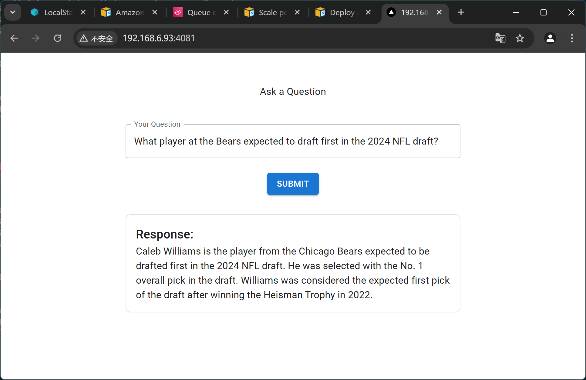

# hi-adaptive-rag

A Question/Answer demo based on [LangChain Adaptive RAG](https://langchain-ai.github.io/langgraph/tutorials/rag/langgraph_adaptive_rag/#compile-graph.)

## Screenshot

<div align="center" width="100%">
  
</div>

## Setup Instructions

1. First, clone this repository and navigate to the project directory:

   ```bash
   $ git clone https://github.com/qiangyt/hi-adaptive-rag.git
   $ cd hi-adaptive-rag
   ```

2. Backend Setup

   1. Create a Python Environment
     
     Ensure you have Python 3.11 or higher installed. Set up a virtual environment and activate it:

     ```bash
     $ python -m venv venv
     $ source venv/bin/activate
     ```

   2. Navigate to the backend directory and install the required packages:

      ```bash
      $ cd backend
      $ pip install --no-cache-dir -r requirements.txt
      ```
  
   3. Configure Environment Variables
  
      Create a `.env` file in the `backend` folder based on the example file provided [.backend/.env.example](./backend/.env.example).
     
      At a minimum, define the following keys:

      - OPENAI_API_KEY
      - TAVILY_API_KEY
     
      Example `.env` file:
    
      ```bash
      OPENAI_API_KEY=your_openai_api_key
      TAVILY_API_KEY=your_tavily_api_key
      ```

3. Web Setup
   
    Navigate to the web directory and install frontend dependencies:

    ```bash
    $ cd web
    $ npm ci
    ```

## Run the Application
  
1. Start the Backend

   In the `backend` folder, run the backend server:

   ```bash
   $ cd backend
   $ ./run.sh
   ```

2. Start the Web Application
  
   Open a new terminal, navigate to the web folder, and start the development server:
  
   ```bash
   $ cd web
   $ npm run dev
   ```

3. Access the Application

   Open your browser and visit: http://localhost:4081